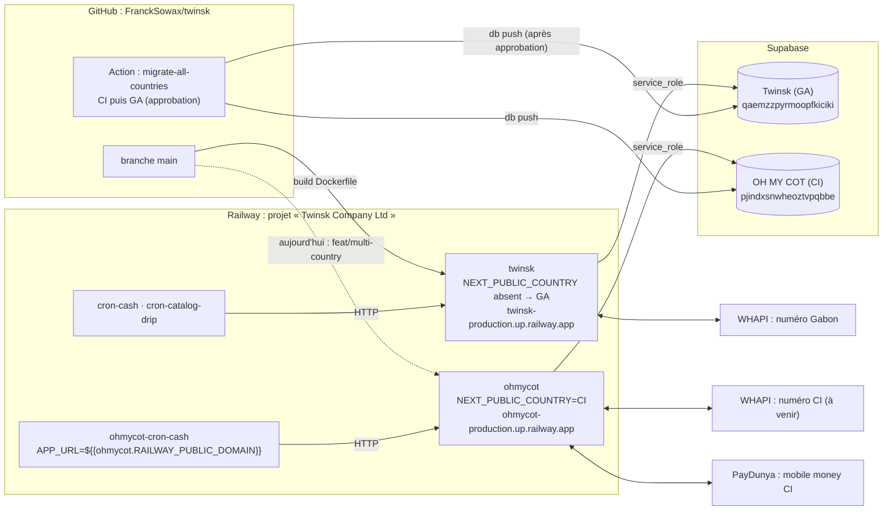

# Multi-pays : Oh My Gab (Gabon) et Oh My Cot (Côte d'Ivoire)

Un seul dépôt, une seule branche `main`, **un déploiement et un projet Supabase par pays**. Le pays est choisi par `NEXT_PUBLIC_COUNTRY` (`GA` par défaut, `CI`) au moment du build.

Documents de la mission, dans l'ordre :

| # | Document | Contenu |
|---|---|---|
| 0 | [00-discovery.md](00-discovery.md) | État des lieux de départ |
| 1 | [01-audit.md](01-audit.md) | 285 valeurs propres au Gabon repérées dans le code |
| 2 | [02-country-layer.md](02-country-layer.md) | Couche de configuration par pays |
| 3 | [03-server-secrets.md](03-server-secrets.md) | Variables, adresses d'appel, expéditeurs |
| 4 | [04-payments.md](04-payments.md) | Paiements (PayDunya en CI) |
| 5 | [05-supabase.md](05-supabase.md) | Migrations comme source de vérité |
| 6 | [06-ci-project.md](06-ci-project.md) | Projet Supabase CI |
| 7 | [07-deploy.md](07-deploy.md) | Déploiement Railway, santé, workflow de migrations |
| — | [TODO-franck.md](TODO-franck.md) | Tout ce qui reste à fournir ou décider |
| — | [legal-CI.md](legal-CI.md) | Plan des textes légaux CI (à rédiger par un juriste) |

## Architecture



Le navigateur ne parle jamais à Supabase : tout passe par les routes serveur Next.js avec la clé `service_role`.

## Où vit chaque réglage

| Réglage | Fichier ou endroit | Remarque |
|---|---|---|
| Pays du déploiement | `NEXT_PUBLIC_COUNTRY` (Railway), lu au **build** | Déclaré en `ARG` dans le `Dockerfile`, sinon ignoré par Railway |
| Identité, devise, téléphone, contacts, agence, fret, délais, modules | `src/config/countries.ts` (`COUNTRY`) | Aucune valeur de pays ailleurs dans le code |
| Textes propres au pays | `src/content/<PAYS>/index.ts` (`CONTENT`) | Gabon : textes d'origine mot pour mot |
| Visuels (haut de /bio, image de partage, icône) | `public/brands/<PAYS>/` | |
| Modules (partie Twinsk visible ou non) | `COUNTRY.modules` + `src/lib/modules.ts` + `src/proxy.ts` | Option B : Twinsk au Gabon seulement |
| Moyens de paiement | `COUNTRY.paymentProviders` → `src/lib/payments/methods.ts` | PayDunya : `src/lib/payments/paydunya.ts` |
| Schéma de base | `supabase/migrations/` | Source de vérité |
| Données de référence | `supabase/seed/reference/{common,GA,CI}.sql` | Rejouables |
| Réglages Supabase (Auth, API, stockage local) | `supabase/config.toml` | Domaine par `env(SUPABASE_AUTH_SITE_URL)` |
| Buckets | `scripts/supabase/buckets.ts` | Recréés par `recreate-buckets.ts` |
| Secrets et clés | Variables Railway du service ; `.env.example` pour les noms | Jamais dans le dépôt |
| Tâches planifiées | Services cron Railway (`curl`), `APP_URL` par référence | Pas de pg_cron |
| Automatisation des migrations | `.github/workflows/migrate-all-countries.yml` | Secrets et environnements GitHub |

## Lancer les migrations pour tous les pays

**Voie normale.** Ajouter un fichier dans `supabase/migrations/` (`supabase migration new <nom>`), le tester en local, le fusionner dans `main`. Le workflow `migrate-all-countries` applique alors :
- la Côte d'Ivoire d'abord ;
- le Gabon ensuite, après ton approbation dans GitHub (environnement `supabase-ga`).

Il s'arrête au premier échec et indique le pays en cause.

**À la main**, pays par pays, avec la CLI 2.117 ou plus récente (`npx supabase@2.117.0` sur un Mac Intel) :

```bash
supabase link --project-ref <REF_DU_PAYS>
supabase migration list
supabase db push --dry-run
supabase db push
```

**Vérifier que deux pays ont le même schéma** (lecture seule) : exécuter `scripts/supabase/schema-fingerprint.sql` sur chaque projet et comparer les lignes.

**Vérifier un déploiement :** `npx tsx scripts/smoke.ts`, ou `--country CI --url https://…`.

## Ajouter un 3ᵉ pays en moins d'une heure

Exemple : Cameroun, code `CM`. Chaque étape est courte, parce que tout ce qui varie passe par `COUNTRY`, `CONTENT` et les migrations.

**Code (≈ 20 min)**
1. `src/config/countries.ts` : ajouter `'CM'` à `CountryCode`, puis une entrée `COUNTRIES.CM` en copiant `CI`. Renseigner :
   - identité et marque ;
   - `currency` (le XAF pour le Cameroun) ;
   - `timezone`, `phonePrefix`, `phoneRegex`, `localPhoneDigits` ;
   - `domain` ;
   - `paymentProviders`, `freight`, `transit` ;
   - `modules.twinsk`.
2. **Devise hors franc CFA seulement :** l'ajouter à `LocalCurrency` (`src/config/countries.ts`) et au taux de `src/lib/formatCurrency.ts`, avec une migration qui l'autorise dans les contrôles `offers_offer_currency_check` et `requests_proposal_currency_check`.
3. `src/content/CM/index.ts` : copier `src/content/CI/index.ts`, adapter les textes, déclarer le pays dans `src/content/index.ts`.
4. `public/brands/CM/` : image du haut de /bio et icône d'onglet.
5. **Mobile money par PayDunya :** ajouter les canaux du pays dans `CHANNELS` (`src/lib/payments/paydunya.ts`), d'après la documentation officielle.
6. `npm test`, puis `NEXT_PUBLIC_COUNTRY=CM npx next build`.

**Base (≈ 15 min)** : créer le projet Supabase, puis dans l'ordre :
- `supabase link` ;
- `db push` ;
- `supabase db query --linked -f supabase/seed/reference/common.sql`, puis la même chose avec `CM.sql` (à écrire sur le modèle de `CI.sql`) ;
- `config diff` puis `config push`, avec `SUPABASE_AUTH_SITE_URL` ;
- `recreate-buckets.ts --apply`.

Voir [06-ci-project.md](06-ci-project.md) pour le détail.

**Hébergement (≈ 15 min)**, dans le même projet Railway :
- service `<marque>` sur le même dépôt ;
- domaine Railway ;
- variables `NEXT_PUBLIC_COUNTRY=CM`, `NEXT_PUBLIC_SITE_URL=https://${{RAILWAY_PUBLIC_DOMAIN}}`, clés Supabase, secrets générés ;
- service `<marque>-cron-cash` avec `APP_URL` et `CRON_SECRET` par référence.

Voir [07-deploy.md](07-deploy.md).

**Automatisation (≈ 5 min)** :
- ajouter une ligne `CM` à la matrice de `migrate-all-countries.yml` (le secret `CM_PROJECT_REF` est retrouvé d'après le code pays) ;
- ajouter le secret `CM_PROJECT_REF` et l'environnement GitHub ;
- lancer `npx tsx scripts/smoke.ts --country CM --url https://…`.

## Règles

Voir la section **Multi-pays** de `/CLAUDE.md`.
